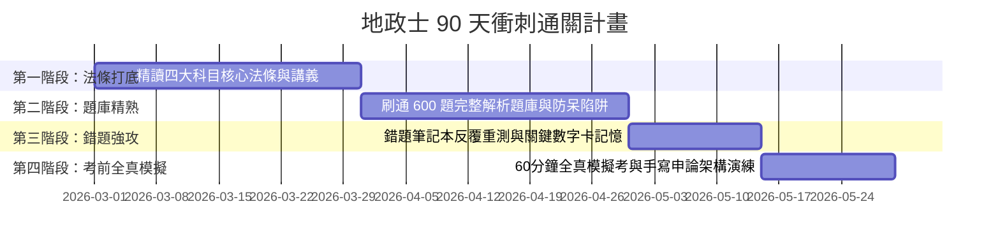

# 地政士（土地登記專業代理人）專技普考：通關全戰略指南與讀書計畫

> **目標：一次上榜、穩拿 75+ 高分！** 地政士國家專技普考兼具高度法律專業度與市場獨佔執業權，是不動產產權移轉、節稅規劃與資產傳承領域含金量最高之國家專業證照。

---

## 壹、考試制度與及格標準

1. **主管機關**：考選部主辦之專門職業及技術人員普通考試地政士考試（每年 6 月舉行一次）。
2. **及格門檻**：
   - 採**總成績滿 60 分及格**（總成績以各應試科目成績平均計算之）。
   - **零分限制**：應試科目中有一科成績為 0 分者，不予及格。
   - **專業科目限制**：專業科目平均成績未滿 50 分者，不予及格。
   - 缺考之科目，以 0 分計算。
3. **考試科目與題型**：
   - 普通科目：國文（作文）100分。
   - 專業科目一：民法概要與信託法概要（100分，各占50分）。
   - 專業科目二：土地法規（100分，含土地法、平均地權條例、土地徵收條例、地政士法）。
   - 專業科目三：土地登記規則（100分，含土地登記規則、地籍測量實施規則）。
   - 專業科目四：土地稅法規（100分，含土地稅法、房屋稅條例、契稅條例、遺產及贈與稅法、房地合一稅、稅捐稽徵法）。

---

## 貳、四大專業科目得分戰略與配分權重

| 專業科目 | 難易度 | 目標分數 | 核心高頻考點與作答戰略 |
| :--- | :---: | :---: | :--- |
| **民法概要與信託法概要** | ★★★★★ | **65 ~ 75 分** | 總則意思表示/代理、物權共有物處分/抵押權、債編買賣/租賃/侵權、親屬繼承特留分與夫妻財產制；信託財產獨立性與受託人義務。 |
| **土地法規** | ★★★★☆ | **70 ~ 80 分** | 土地法第34條之1多數決處分與優先購買權、第73條之1未辦繼承列管代管、平均地權條例打炒房禁轉售罰5000萬、土地徵收協議價購與補償、地政士懲戒罰則。 |
| **土地登記與測量** | ★★★☆☆ | **75 ~ 85 分** | **搶分主戰場！** 土地登記總則單獨申請24款、繼承登記與代位繼承、抵押權塗銷與次序讓與、預告登記與查封限制登記、建物保存登記、鑑界與地籍圖重測。 |
| **土地稅法規** | ★★★☆☆ | **80 ~ 90 分** | **全卷最高分衝刺科！** 土增稅一生一次與一生一屋、重購退稅要件與5年列管、地價稅2‰自用、囤房稅2.0全國歸戶單一自住1%/非自住2.0%~4.8%、契稅6大稅率、遺贈稅免稅額與生前2年贈與併計、房地合一2.0四級距與自住400萬免稅。 |

---

## 參、90天高勝率四階段衝刺讀書計畫

1. **第一階段（Day 01 - 30）：法規體系建構**
   - 每日精讀 1 科重點講義（詳讀 `notes/01` 至 `notes/04`），建立法規法理架構與體系圖。
2. **第二階段（Day 31 - 60）：600 題題庫逐題擊破**
   - 每日練習 20 題，善用 Web 學習平台之「章節練習」模式。
   - 務必對照詳解中的「法定條號依據」與「考點防呆提示」。
3. **第三階段（Day 61 - 75）：錯題弱點強化與數字速記**
   - 開啟 Web 平台「錯題筆記本」，將所有做錯過的題目重新測驗至正確率 100%。
   - 熟背 `exam/quick-review-cards.md` 內之 120 組天數、比例、稅率與罰鍰。
4. **第四階段（Day 76 - 90）：考前全真模擬考**
   - 使用 Web 平台「全真模擬考」功能，每週模擬 3 次，掌控 60 分鐘答題節奏與抗壓性。

---

## 肆、申論題法學作答「三段論法」黃金模板

地政士申論題必須嚴格採「三段論法」撰寫，層次分明：

1. **大前提（法規依據與要件）**：
   - 「按土地法第34條之1第1項規定……其立法意旨係在於……」
2. **小前提（事實涵攝）**：
   - 「查本案中甲、乙、丙三人共有該筆土地，甲乙應有部分合計達三分之二……合於多數決處分之法定要件……」
3. **結論（法律效果與處置）**：
   - 「綜上所述，地政事務所應予受理該所有權移轉登記，惟申請人仍應切結踐行書面通知及價金受領提存程序……」

掌握此架構，閱卷老師必給頂級高分！
